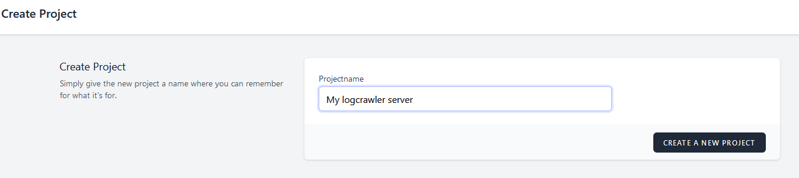
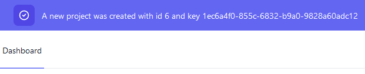
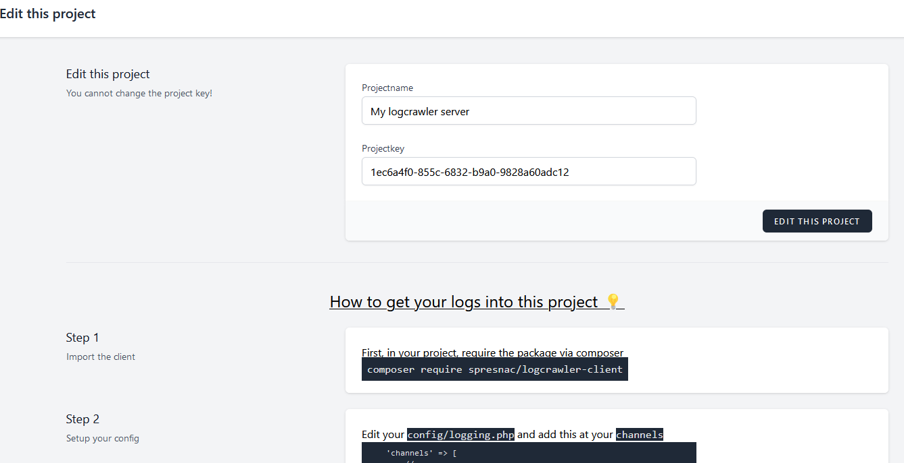
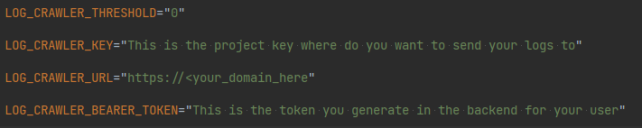
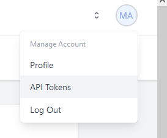
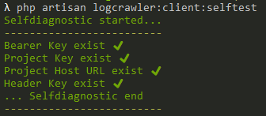
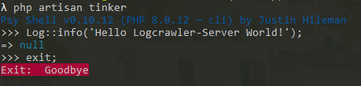

# Install the logcrawler server
I assume that you are familiar with the basics of deploying a laravel application like
- Clone the repo
- Copy the `.env.example` to `.env`
- Fit the most basic seetings in `.env` to your needs (like database, caching, mail, ...)
- run `composer install` and `npm install && npm run dev`
- run `php artisan migrate`

The next steps describe only the logcrawler server specific steps

## Nice to know first
In the standard configuration, logcrawler server comes with it's own `logcrawler-client` installation in composer, so you can start to watch your server right away.
Also, you have a tool to backup and restore your database and one to create your first user from your cli.

## Create the first admin user
First of all, you need to add yourself to the system.

You are free to enable the default registration by setting the `.env` key
```dotenv
LOGCRAWLER_SERVER_ENABLE_REGISTRATION=true
```
The registration is disabled by default!

Alternativly, you can also use the cli for this: Run `php artisan user:create` and follow the steps to createyourself as you like.

After that, remember the user id and run `php artisan user:activate <user_id>` to activate that user!

One more step is needed: In your database's `users` table, change the `is_admin` to an integer `1` to get admin rights 😉. There is intentionally no script for this! 

## Configure your first project
Now, open your browser and goto your installation and add an `/login` to get to the login. Enter your credentials and login.

Keep in mind that the login route is avail, but not visible by default. To enable a link from the Homepage, just edit your `.env` and set
```dotenv
LOGCRAWLER_SERVER_ENABLE_VISIBLE_LOGIN=true
```

In the dashboard on top right, you see a button to create a `New Project`. After clicking on this, you can enter a name for the new project. Try it with `My logcrawler server` and click on `Create a new project`.  


You will be redirected to the dashboard with the new project created. Every time you create a project, you will get a flash message on top of the dashboard to inform you about the creation of the new project with it's key. This is important for you once you are familiar with the procedure and you only need to know the key.  


Your project list is in the center of the screen. On every line, you see the project name, the project owner (important when using the teams function), the last log date, the number of logs collected and on the right side a tool-icon. Click on that icon to get to the project settings, where you can change the project name, you see the project key (not changeable) and below that, a short installation setup for the logcrawler client.  


In your logcrawler serer installtion there is already the logcrawler client installed.  
Please make yourself familiar with all the steps, for this is a todo in other projects. You can check the servers `config` to be sure.

Now, open your `.env`. You have some options to fill for the logcrawler-client.  


| Key name                   | Description                                                                                      |
|----------------------------|--------------------------------------------------------------------------------------------------|
| `LOG_CRAWLER_KEY`          | This is the project key (that UUID)                                                              |
| `LOG_CRAWLER_URL`          | Enter your server installtions url here                                                          |
| `LOG_CRAWLER_BEARER_TOKEN` | Enter your API token here, see the next line below this table                                    |
| `LOG_CRAWLER_THRESHOLD`    | After how many collected messages should the client send the data, default is `0` for every time |

### Where to get the Bearer Token?
Click on the most top right on your name-symbol and choose `API Tokens`.  
  
On that page, you can create a new token and give it a name. After clicking on `CREATE` you will the token ONLY ONE TIME, so remeber it good 😉. I leave it up to you to create one token for all or one token for each project - it will work both.
Now, this is the value for your `.env` to place at `LOG_CRAWLER_BEARER_TOKEN`.

## Testing your doings
Now, your first system is ready to run.  
First of all, you should run `php artisan logcrawler:client:selftest` to check if there are any code related issues.  
  
This selfdiagnostic is part of the `client`, so you can run this on every project to be sure.

## Send a test message
Now, we are ready to collect some logs.  
Open your cli, change to your logcrawler server root directory (where you run all other `php artisan` commands too), switch to tinker mode and send a test message from there.
```
php artisan tinker
Log::info('Hello Logcrawler-Server World!');
exit;
```


You can see this log in your project's log view. Switch to the dashboard and click on the project name (in this example, this would be `My logcrawler server`). Now you see all logs collected and you should the line with `Hello Logcrawler-Server World!`.

## Have fun
You have successfully configured your first project, now you can equip your other projects with `logcrawler-client` and collect data into one view.  
Have fun...
